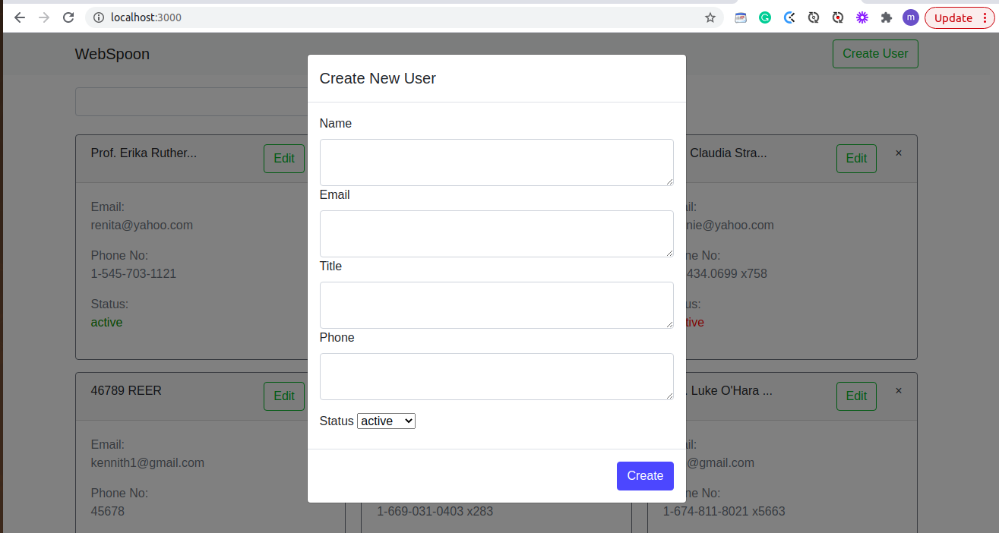
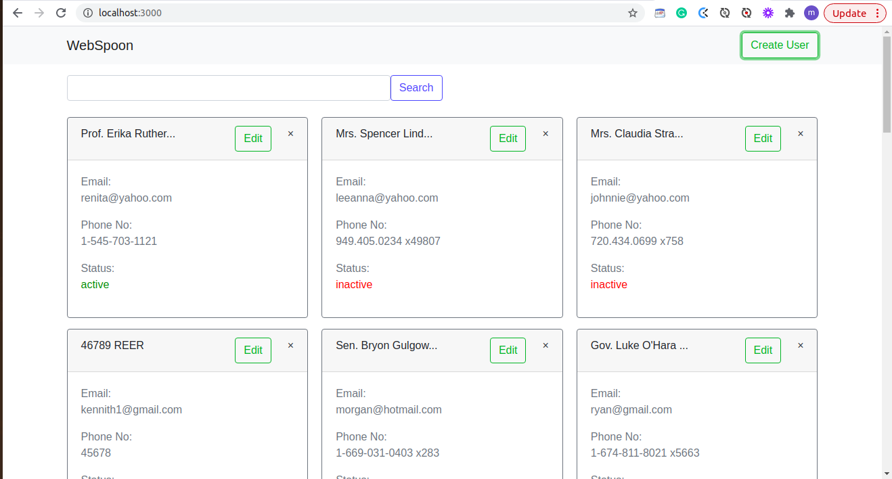

# Single Index View

This is an Engineer Assessment Project - Level 3:

### Installation
You need to have this tools to start using it:
* Ruby - 2.7.0
* Rails - 5.2.4.3
* Clone the repo git clone git clone git@github.com:chinweokwu/Webspoons_Project.git
* Open your terminal and cd to the project`s folder
* Install gems with using 'bundle install'
* Run migrations with bin/rake db:migrate
* Run 'rails server' and go to your browser 'http://localhost:3000'
* For testing run 'rails console'

## Author

👤 **Morah Paul**

- GitHub:[@github/chinweokwu](https://github.com/chinweokwu)
- Linkedin:[linkedin/morah](https://www.linkedin.com/)

## 🤝 Contributing

Contributions, issues, and feature requests are welcome!
Feel free to check the [issues page]().

## Show your support

Give a ⭐️ if you like this project!